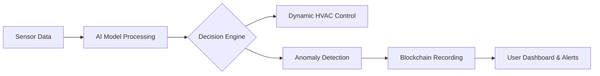

# ❄️ AI-Powered Smart Cold Storage System with Blockchain Integration

## 🚀 Overview

The **AI-Powered Smart Cold Storage System** uses AI, IoT, and Blockchain to optimize storage conditions for perishable goods. It predicts ideal environmental conditions, prevents spoilage, and securely records critical data on the blockchain.

---

## 🎯 Key Features

- 🔹 **AI-Based Environmental Control:** Dynamic adjustment of temperature, humidity, and airflow.
- 🔹 **Spoilage & Fault Detection:** Anomaly detection and predictive maintenance.
- 🔹 **Blockchain Security:** Immutable and transparent data logging.
- 🔹 **Real-time Dashboard:** Monitor and visualize data with user-friendly analytics.
- 🔹 **Energy Optimization:** Smart control to minimize power consumption.

---

## ⚡️ System Architecture

## Workflow Summary

1. **Sensor Data Collection:** Real-time data from IoT sensors.
2. **AI Decision Engine:** Predicts ideal conditions and detects anomalies.
3. **Blockchain Storage:** Stores critical data securely.
4. **Control & Alerts:** Adjusts HVAC and alerts operators if anomalies occur.
5. **User Dashboard:** Displays real-time and historical dat
