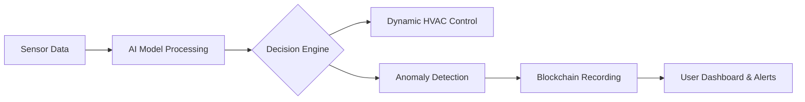

# ❄️ AI-Powered Smart Cold Storage System with Blockchain Integration

## 🚀 Overview

The **AI-Powered Smart Cold Storage System** uses AI, IoT, and Blockchain to optimize storage conditions for perishable goods. It predicts ideal environmental conditions, prevents spoilage, and securely records critical data on the blockchain.

---

## 🎯 Key Features

- 🔹 **AI-Based Environmental Control:** Dynamic adjustment of temperature, humidity, and airflow.
- 🔹 **Spoilage & Fault Detection:** Anomaly detection and predictive maintenance.
- 🔹 **Blockchain Security:** Immutable and transparent data logging via smart contracts.
- 🔹 **Real-time Dashboard:** Monitor and visualize data with user-friendly analytics.
- 🔹 **Energy Optimization:** Smart control to minimize power consumption.

---

## 🛠️ Tech Stack

- **Frontend:** React, Vite, TypeScript, TailwindCSS
- **UI Components:** Material UI (@mui/material), Lucide React
- **Data Visualization:** Recharts, @mui/x-charts, React Gauge Chart
- **Blockchain Integration:** Ethers.js
- **Animations:** Framer Motion

---

## ⚡️ System Architecture


```mermaid
graph LR
    A[Sensor Data] --> B[AI Model Processing]
    B --> C{Decision Engine}
    C --> D[Dynamic HVAC Control]
    C --> E[Anomaly Detection]
    E --> F[Blockchain Recording]
    F --> G[User Dashboard & Alerts]
```

## Workflow Summary

1. **Sensor Data Collection:** Real-time data from IoT sensors.
2. **AI Decision Engine:** Predicts ideal conditions and detects anomalies.
3. **Blockchain Storage:** Stores critical data securely.
4. **Control & Alerts:** Adjusts HVAC and alerts operators if anomalies occur.
5. **User Dashboard:** Displays real-time and historical data.

---

## 🚥 Getting Started

### Prerequisites

- Node.js (v18 or higher recommended)
- npm or yarn

### Installation

1. Clone the repository and navigate to the project directory:
   ```bash
   cd AI-BASED-COLD-STORAGE-AND-BLOCKCHAIN-TRADE-PLATFORM
   ```
2. Install the dependencies:
   ```bash
   npm install
   ```

### Running the Application

Start the development server:

```bash
npm run dev
```

This will launch the application on a local development port (typically `http://localhost:5173`).

---

## 📜 Available Scripts

- **`npm run dev`**: Starts the Vite development server.
- **`npm run build`**: Builds the application for production.
- **`npm run preview`**: Previews the production build locally.
